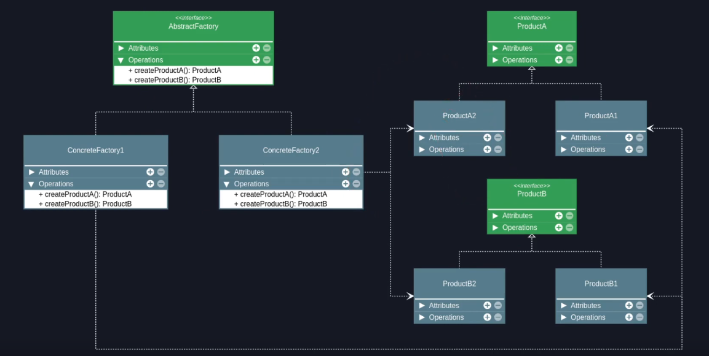

# Abstract Factory

## Premissa

- Fornecer uma interface para criação de famílias de objetos relacionados ou dependentes, sem especificar suas classes concretas.

## Sobre o Abstract Factory

- É um padrão de criação, portanto lida com a criação de objetos.
- É uma fábrica, assim como o Factory Method e geralmente é composto por múltiplos Factory Methods.
- Visa agrupar famílias de produtos compatíveis, criando uma fábrica concreta por grupo de objetos compatíveis.
- Separa o código que cria do código que usa os objetos (SRP).
- Permite fácil implementação de novas famílias de objetos (OCP).
- Toda a programação fica focada nas interfaces e não em implementações.

## Estrutura

## Aplicabilidade

### Usar o Abstract Factory quando:

- Um sistema deve ser independente de como seus produtos são criados, compostos ou representados.
- Um sistema dever ser configurado com uma família de produtos que podem (ou não) trabalhar juntos.
- Uma família de objetos for projetada para ser usada em conjunto e é necessário garantir essa restrição.
- For preciso fornecer uma biblioteca de classes de produtos e quer revelar somente suas interfaces, não suas implementações.

## Consequências

### Bom

- Os produtos sempre serão compatíveis entre si.
- Aplicação clara do Open/Closed Principle, ou seja, é fácil adicionar novas fábricas e produtos.
- Aplicação clara do Single Responsibility Principle, o código que cria está separado do código que usa os objetos.

### Ruim

- Muitas classes e maior complexidade será atribuída ao código.

---

### Referências

[Abstract Factory Teoria - Padrões de Projeto](https://youtu.be/UPSuHqNsNs4?list=PLbIBj8vQhvm0VY5YrMrafWaQY2EnJ3j8H)
