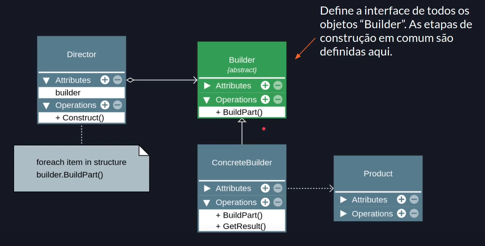
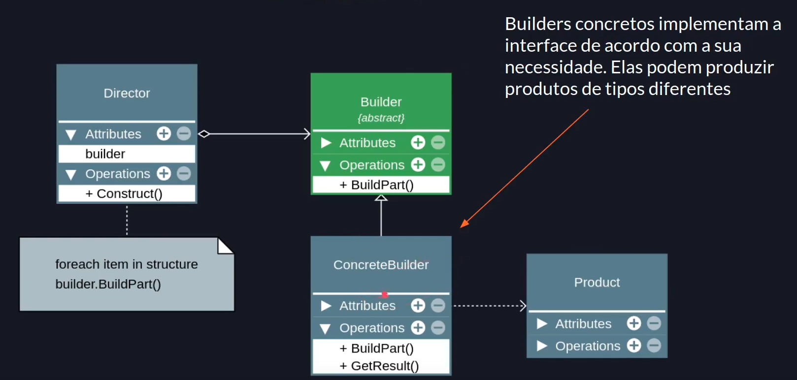
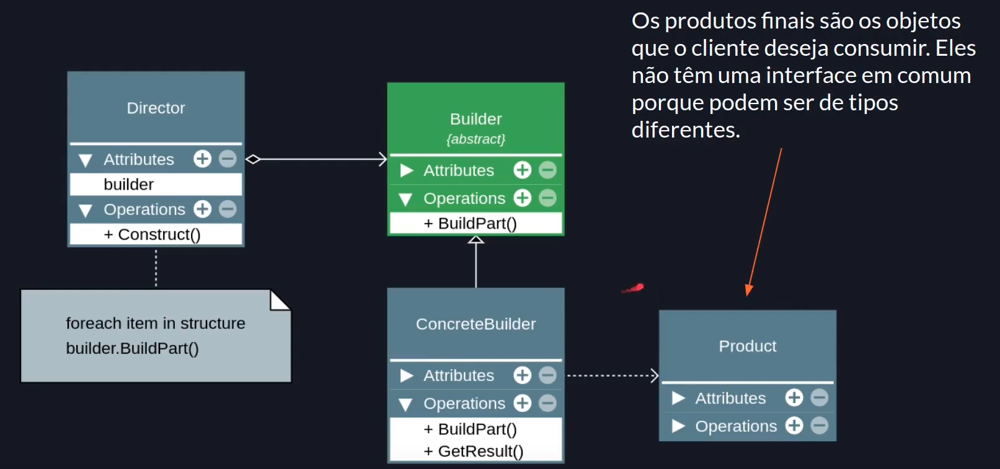
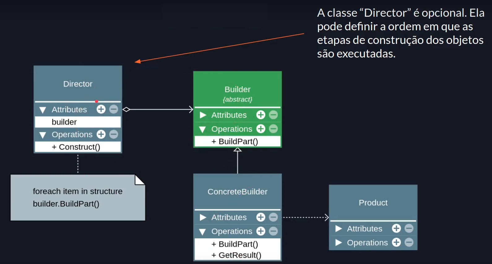

# Builder

## Premissa

- Separar a construção de um objeto complexo da sua representação, de modo que o mesmo processo de construção possa criar diferentes representações.

## Visão geral

- O padrão sugere a separação do código que cria e o código que usa o objeto.
- Trata da criação de objetos complexos.
  - Objetos que possuem construtores grandes/complexos.
  - Composição de vários objetos (composite).
  - Algoritmo de criação de objeto complexo.
- Permite a criação de um objeto em etapas.
- Permite method chaining (encadeamento de métodos).
- O objeto final pode variar de acordo com a necessidade.
- É um padrão complexo.

## Estrutura






## Exemplo

```javascript
export class Person {
  constructor(public name?: string, public age?: number) {}
}

/**
 * O padrão não se aplica a classe abaixo, levando em consideração a simplicidade da classe.
 * A classe PersonBuilder é somente um exemplo de aplicação.
 * O Builder deve ser aplicado em classes complexas.
 */
export class PersonBuilder {
  private person = new Person();

  newPerson(): void {
    this.person = new Person();
  }

  setName(name: string): this {
    this.person.name = name;
    return this; // method chaining
  }

  setAge(age: number): this {
    this.person.age = age;
    return this;
  }

  getResult(): Person {
    return this.person;
  }
}

const personBuilder = new PersonBuilder();
const person1 = personBuilder.setName('Willian').setAge(22).getResult();
personBuilder.newPerson();
const person2 = personBuilder.setName('Moreno').setAge(22).getResult();
```

## Consequências

### Bom

- Separa a criação de utilização.
- O cliente não precisa criar objetos diretamente.
- O mesmo código pode construir objetos diferentes.
- Ajuda na aplicação dos princípios SRP e OCP.

> SRP: Single Responsibility Principle (Princípio da responsabilidade única)
> OCP: Open-Closed Principle (Princípio aberto-fechado)

### Ruim

- O código final pode se tornar muito completo.

---

### Referências

(Builder Teoria - Padrões de Projeto)[https://youtu.be/2VwLvwsIu-8?list=PLbIBj8vQhvm0VY5YrMrafWaQY2EnJ3j8H]
