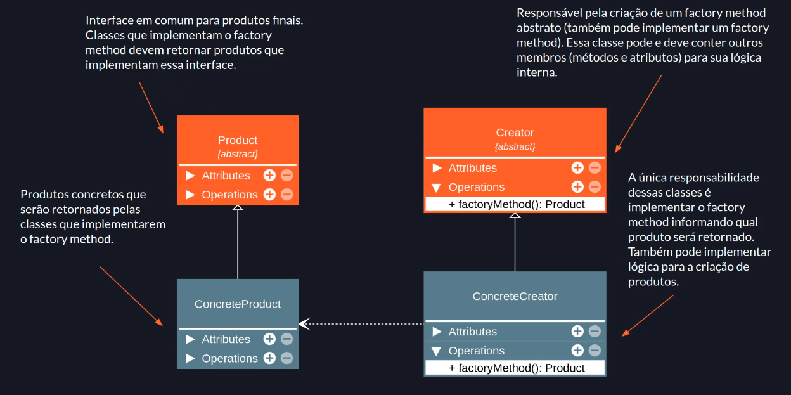

# Factory Method

## Premissa

- Definir uma interface para criar um objeto, mas deixar as subclasses decidirem que classe instanciar. O Factory Method permite adiar a instanciação para as subclasses.
- Factory (Fábricas) são simplesmente operações (funções ou métodos) que criam objetos.

## Factory em geral

```javascript
type Car = { model: string, motor: string };
type CarPrototype = { showDetails(): void };

const carPrototype: CarPrototype = {
  showDetails(): void {
    console.log(this);
  },
};

const carFactory = (model: string, motor: string): Car & CarPrototype => {
  const idAsPrivateMember = Math.floor(Math.random() * 1000);
  const carObj = Object.create(carPrototype);
  return Object.assign(carObj, { id: idAsPrivateMember, model, motor });
};

const car1 = carFactory('Porsche', 'V8');
car1.showDetails(); // { id: 210, model: 'Porsche', motor: 'V8' }
const car2 = carFactory('Dodge', 'V8');
car2.showDetails(); // { id: 321, model: 'Dodge', motor: 'V8' }
```

## Sobre o Factory Method

- É um padrão de projeto de criação (lida com a criação de objetos).
- Oculta a lógica de instanciação do código cliente. O método fábrica será responsável por instanciar as classes desejadas.
- É obtido através de herança. O método fábrica pode ser criado ou sobrescrito por subclasses.
- Da flexibilidade ao código cliente permitindo a criação de novas factories sem a necessidade de alterar código já escrito (OCP).
- Pode usar parâmetros para determinar o tipo dos objetos a serem criados ou os parâmetros a serem enviados aos objetos sendo criados.

> Código cliente: Código que tende a repetir muito dentro da aplicação.

## Estrutura



## Implementação

```javascript
interface Product {
  sayHi(): void;
}

class ConcreteProduct implements Product {
  sayHi(): void {
    console.log('Hi');
  }
}

abstract class Creator {
  abstract factoryMethod(): Product;

  createAndShow(): void {
    const product = this.factoryMethod();
    console.log(product);
  }
}

class ConcreteCreator extends Creator {
  factoryMethod(): Product {
    return new ConcreteProduct();
  }
}

const creator = new ConcreteCreator();
const product = creator.factoryMethod();
product.sayHi(); // Hi
creator.createAndShow(); // ConcreteProduct {}
```

## Aplicabilidade

### Use o factory method:

- Quando não souber com certeza quais os tipos de objetos o código vai precisar.
- Para permitir a extensão de suas factories para criação de novos objetos (isso ajuda a aplicar o Open/Closed Principle).
- Para desacoplar o código que cria do código que usa as classes (Single Responsibility Principle).
- Para dar um hook (gancho) às subclasses para permitir que elas decidam a lógica de criação de objetos.
- Para eliminar duplicação de código na criação de objetos.

## Consequências

### Bom

- Ajuda na aplicação do Open/Closed Principle. O código vai estar aberto para extensão.
- Ajuda na aplicação do Single Responsibility Principle. Separa o código que cria do código que usa o objeto.
- Ajuda no desacoplamento do código.

### Ruim

- Se usado sem necessidade, pode causar uma explosão de subclasses. Será necessário uma classe ConcreteCreator para cada ConcreteProduct.

---

### Referências

[Factory Method Teoria - Padrões de Projeto](https://youtu.be/1rB0PhvAwiU?list=PLbIBj8vQhvm0VY5YrMrafWaQY2EnJ3j8H)
