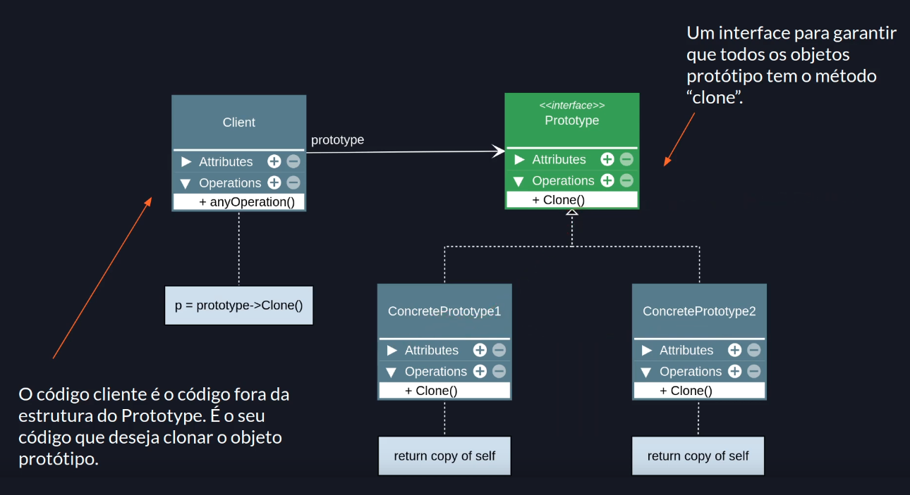
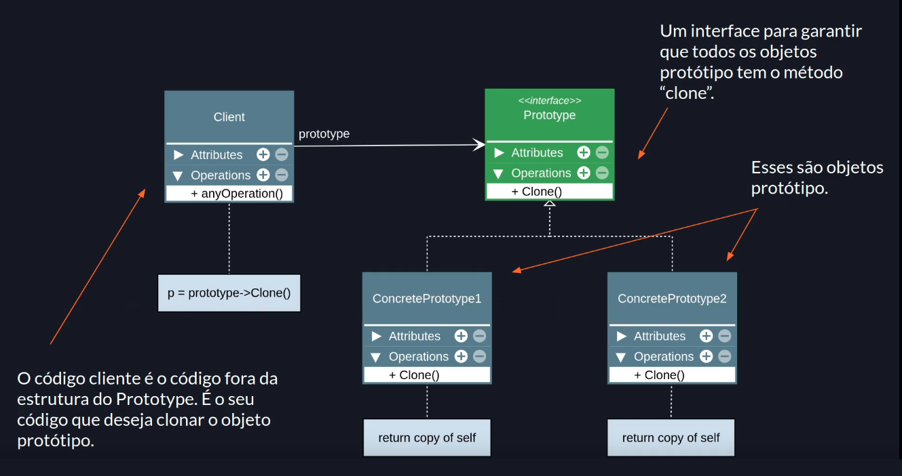

# Prototype

## Premissa

- Especificar os tipos de objetos a serem criados usando uma instância-protótipo e criar novos objetos pela cópia desse protótipo

## Sobre JavaScript e TypesScript

- JavaScript e TypesScript são linguagens baseadas em protótipos. Vale ressaltar que TypesScript é JavaScript.
- Objetos estão diretamente ligados a outros objetos.[
- Pode-se construir um objeto com base em outro, herdando os métodos e propriedades.
- A "herança" é obtida via delegação (um objeto delega algo para seu protótipo).
- Uma das maneiras mais simples para manipular o protótipo de um objeto é usando `Object.create(prototypeObject)`.
- Um costume seria a utilização de classes ou funções construtoras para manipulação de protótipos. Com isso, o JS/TS parecem estar usando o padrão de orientação a objetos clássico, mas por baixo dos panos é uma manipulação de prototype.

> Delegação: transmissão, transferência de poder.

## Visão geral do padrão Prototype

- O tipo de objeto a ser criado é determinado pelo objeto protótipo.
- É tipicamente usado para evitar a recriação de objetos "caros", ou seja, objetos complexos de serem construídos ou pesados no quesito computacional, por exemplo que lidam com muitos dados.
- Ajuda a evitar a explosão, exagerada construção, de subclasses, devido a possibilidade de clonar um objeto muito similar e acrescentar o que for preciso.
- Pode, ou não, manter um registro de objetos protótipos em um objeto separado.
- Geralmente é criado apenas com um método "clone" dentro do objeto protótipo.
- O método clone pode gerar uma "shallow" ou "deep" copy do objeto protótipo.
- Evita que o usuário conheça as classes que criam os objetos.

> Shallow copy: _Uma shallow copy (cópia superficial) de um objeto é uma cópia cujas propriedades compartilham as mesmas referências (apontam para os mesmos valores subjacentes) do objeto de origem a partir do qual a cópia foi feita. Como resultado, ao alterar a origem ou a cópia, você também pode fazer com que o outro objeto também seja alterado ? e, portanto, você pode acabar causando alterações inesperadas na origem ou na cópia._

> Deep copy: _Uma deep copy (cópia profunda) de um objeto é uma cópia cujas propriedades não compartilham as mesmas referências (apontam para os mesmos valores subjacentes) que as do objeto de origem a partir do qual a cópia foi feita. Como resultado, quando você altera a origem ou a cópia, pode ter certeza de que não está fazendo com que o outro objeto também seja alterado; ou seja, você não causará alterações inadvertidas na fonte ou na cópia que não espera._

## Estrutura





## Exemplo

```javascript
interface Prototype {
  clone(): Prototype;
}

class Person implements Prototype {
  constructor(public name: string, public age: number) {}

  clone(): this {
    // Isso não é um clone.
    // Estamos apenas criado em novo objeto que tem este objeto como protótipo.
    const newPerson = Object.create(this);
    return newPerson;
  }
}

const person1 = new Person('Willian', 22);
const person2 = new person1.clone();

console.log(person1.name); // Willian
console.log(person2.name); // Willian
```

```javascript
const person1 = {
  name: 'Willian',
  age: 22,
};

const person2 = Object.create(person1);

console.log(person1.name); // Willian
console.log(person2.name); // Willian

// person1 é igual ao prototype de person2
console.log(person1 === Object.getPrototypeOf(person2));
```

## Aplicabilidade

### Use o padrão prototype:

- Quando precisar que seu código não dependa de classes concretas para a criação de novos objetos.
- Quando quiser evitar explosão de subclasses para objetos muito similares.
- Para evitar a recriação de objetos "caros".

## Consequências

### Bom

- Oculta classes concretas do código cliente.
- Ajuda na criação de objetos caros ou complexos.
- Evita a explosão de subclasses.

### Ruim

- Clonar objetos que tem referências para outros objetos pode ser super complexo.

---

### Referências

[Prototype Teoria - Padrões de Projeto](https://youtu.be/Z-_smcjkdwM?list=PLbIBj8vQhvm0VY5YrMrafWaQY2EnJ3j8H)<br>
[Shallow Copy](https://developer.mozilla.org/en-US/docs/Glossary/Shallow_copy)
[Deep Copy](https://developer.mozilla.org/en-US/docs/Glossary/Deep_copy)
