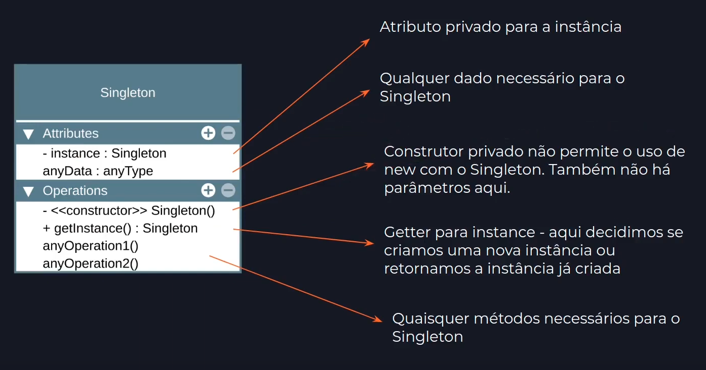

# Singleton

## Premissa

- Uma classe deve conter somente uma instância e fornecer, de forma global, um ponto de acesso aos seus atributos e métodos.
- Geralmente utilizado para acesso a recursos compartilhados, como acesso à base de dados, interfaces gráficas, sistema de arquivos, arquivos de configuração, servidores de impressão, logger, etc.
- Também utilizado para substituir variáveis globais, como em casos de uso de objetos de configuração do sistema como um todo.
- Pode-se permitir acesso global ao Singleton em toda sua aplicação, assim como fazíamos (ou fazemos) com variáveis globais.
- A instância pode ser protegida com encapsulamento, evitando que outro código sobrescreva o seu valor.

## Estrutura



## Implementação

```javascript
export class Singleton {
	private static _instance: Singleton | null = null;

	private constructor() {
		// construtor não pode ser acessado com new.
	}

	static get instance(): Singleton {
		if(Singleton._instance === null)
			Singleton._instance = new Singleton();

		return Singleton._instance;
	}

	const instance1 = new Singleton.instance;
	const instance2 = new Singleton.instance;

	console.log(instance1 === instance2); //true
}
```

## Aplicabilidade

- Usar o Singleton quando uma classe precisa ter somente uma instância disponível em todo a aplicação.
- Usar o Singleton quando perceber que está usando variáveis globais para manter partes importantes do programa, como variáveis de configuração que são usadas por toda a aplicação.

## Consequências

### Bom

- Acesso controlado à instância única.
- É fácil permitir um número maior de instâncias caso mude de ideia.
- Usa _lazy instantiation_, o Singleton só é criado no momento do uso.
- Substitui variáveis globais.

### Ruim

- É mais difícil de testar.
- Viola o princípio da responsabilidade única
- Requer tratamento especial em casos de concorrência.
- Erich Gamma (autor) descreveu que este seria o único padrão que ele removeria se fosse refatorar o livro ?Design Patterns: Elements of Reusable Object-Oriented Software?.

---

### Referências

[Singleton Teoria - Padrões de Projeto](https://youtu.be/x9h8MgAvi_I?list=PLbIBj8vQhvm0VY5YrMrafWaQY2EnJ3j8H)
