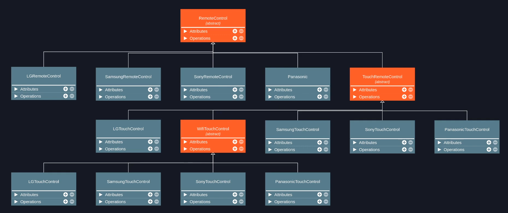
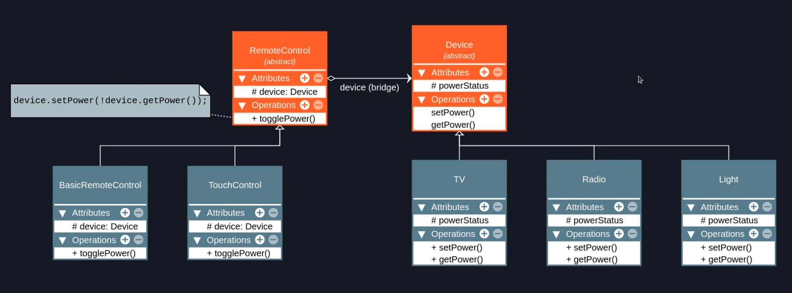
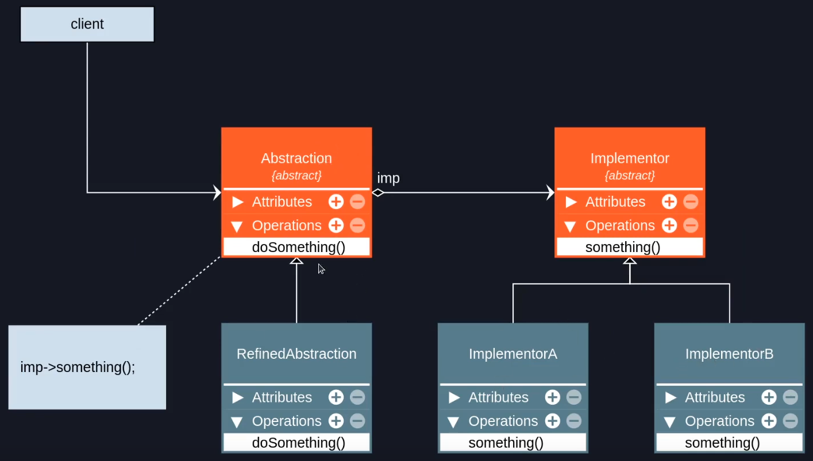

# Bridge

## Premissa

Bridge é um padrão de projeto estrutural que tem a intenção de desacoplar uma abstração da sua implementação, de modo que as duas possam variar e evoluir independentemente.

> **abstração** é um código de alto nível que geralmente delega tarefas para sua implementação.
> **implementação** é o código de baixo nível que realmente faz o trabalho (o código para o qual a abstração delega tarefas).

## Sobre o Bridge

- O bridge foca o trabalho em composição, ou seja, ao invés de extender infinitamente minha estrutura de classes para todas as possíveis variantes por herança, posso apenas manter uma referência para uma implementação dentro da minha abstração. Isso me permite encaminhar chamadas de métodos da abstração para a implementação em tempo de execução.

- O bridge é idêntico ao adapter, o que muda é apenas sua intenção. Veja esse trecho do livro da GoF:

> _A diferença chave entre esses padrões está nas suas intenções… O padrão Adapter faz as coisas funcionarem APÓS elas terem sido projetadas; o Bridge as faz funcionar ANTES QUE_ existam [\.\.\.] (GOF em PT-BR pág. 208)

## Herança e Composição

### Problema

A imagem abaixo é um problema que ocorre na implementação de objetos que utilizam herança, ou seja, a aplicação vai ficando complexa a medida que novas abstrações surgem a partir de outras.

### Solução

Uma solução seria a composição de objetos.

## Estrutura

## Aplicabilidade

### Use o padrão Bridge quando:

- Você souber que sua estrutura terá abstrações (código de alto nível) e implementações dessa abstração (detalhes) que possam variar de maneira independente
- Você souber que o Adapter poderia ser aplicado naquela estrutura (você já conhece a estrutura)
- Você quiser dividir uma classe que possa ter diversas variantes (como em produtos e suas variações de cores: CanetaAzul, CanetaVermelha, CamisetaAzul, CamisetaVermelha, etc...)
- Você quer trocar as implementações em tempo de execução

## Implementação - Teoria

**Observação:** veja o código e os diagramas nessa mesma pasta, eles detalham melhor a implementação do padrão Bridge.

1. **Declare a interface da `Abstração` (`Abstraction` no diagrama):** essa é a interface que seu código cliente usa e todas as abstrações concretas implementam. Ela deve ter os métodos que serão encaminhados para a implementação dessa abstração (`Implementor` no diagrama)
2. **Crie abstrações refinadas que implementam a interface da abstração (`RefinedAbstraction` no diagrama):** você pode criar quantas abstrações concretas precisar para seu código. Essas classes devem encaminhar chamadas de métodos para sua implementação concreta (`ImplementorA` ou `ImplementorB` no diagrama) por composição
3. **Encaminhe as chamadas de método de `Abstraction` para o `Implementor`:** agora você só precisará encaminhar as chamadas de métodos da sua `Abstraction` concreta para o código que está implementando a abstração (`ImplementorA` ou `ImplementorB` no diagrama). Para encaminhar as chamadas, geralmente precisamos ter uma referência do `Implementor` concreto na `Abstraction` concreta (por composição).

## Consequências

### Bom

- Desacopla o código da abstração do código da implementação (SRP)
- Implementa o OCP ao permitir novas abstrações e/ou implementações para código existente
- Tem as mesmas vantagens do Adapter

### Ruim

- Aumenta a complexidade da aplicação quando implementado em locais incorretos

---

### Referências

[Bridge Teoria - Padrões de Projeto](https://youtu.be/-gsuMWLxAko?list=PLbIBj8vQhvm0VY5YrMrafWaQY2EnJ3j8H)
