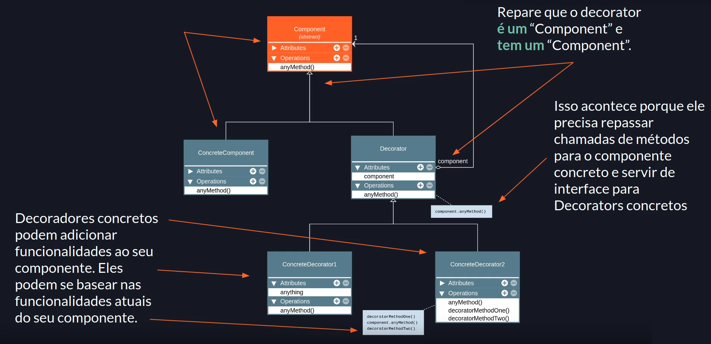

# Decorator

## Premissa

Agregar responsabilidades adicionais a um objeto dinamicamente. Os Decorators fornecem uma alternativa flexível ao uso de subclasses para extensão de funcionalidades.

## Sobre o Decorator

- O Decorator é uma padrão de projeto usado para adicionar funcionalidades a objetos já criados, ou seja, sem a necessidade de alterar nenhum código. Isso faz com que este padrão aplique naturalmente o princípio do aberto/fechado (classes devem estar abertas para extensão, mas fechadas para modificação).
- Usa a composição ao invés da herança (sempre prefira composição ao invés de herança).
- É muito parecido com o "Composite" porém em proposito diferente.
- É utilizado para adicionar funcionalidades a objetos em tempo de execução.
- Finge ser o objeto decorado, porém repassa chamadas de métodos para o mesmo.
- Pode executar ações antes e depois das chamadas dos métodos do objeto decorado.
- Pode manipular dados antes do retorno.

## Estrutura

## Aplicabilidade

### Use o padrão Decorator quando:

- você precisa adicionar funcionalidades em objetos sem quebrar ou alterar o código existente
- você quiser usar composição ao invés de herança
- você percebe que pode ocorrer uma explosão de subclasses em determinada estrutura

## Implementação

Veja o código e os diagramas dessa pasta para entender como o Decorator é implementado.

## Consequências

### Bom:

- Composição é melhor do que herança em grande maioria dos casos
- É fácil adicionar ou remover comportamento de objetos sem tocar em código já escrito ou testado (OCP)
- É possível decorar um objeto já decorado, adicionando ainda mais funcionalidades (camadas)

### Ruim:

- Quanto mais decorators em camadas, mais complexo seu código se torna
